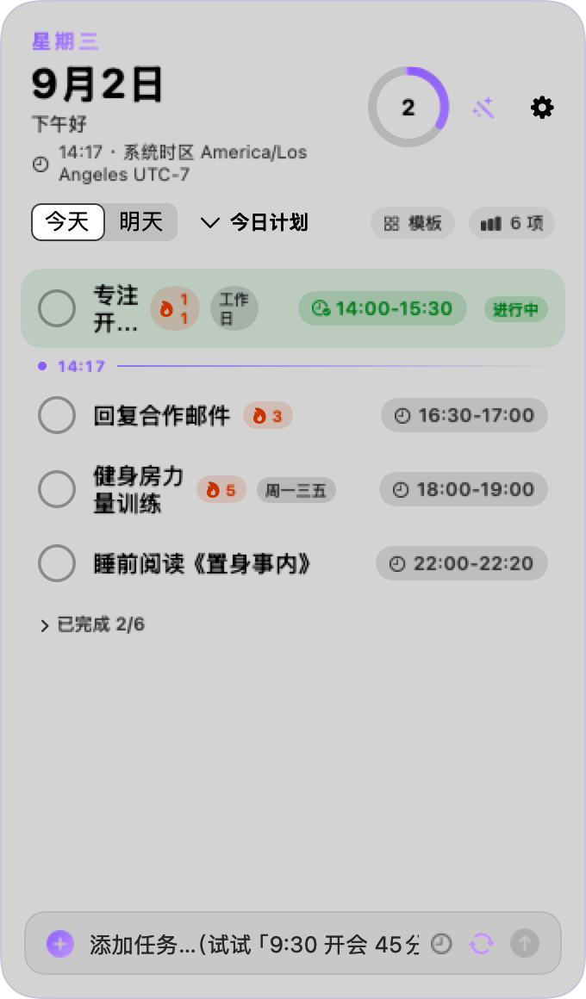
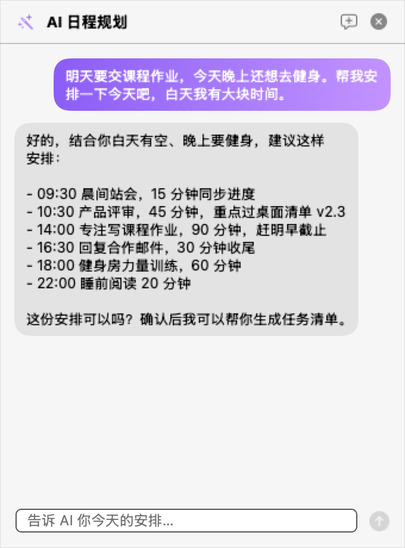
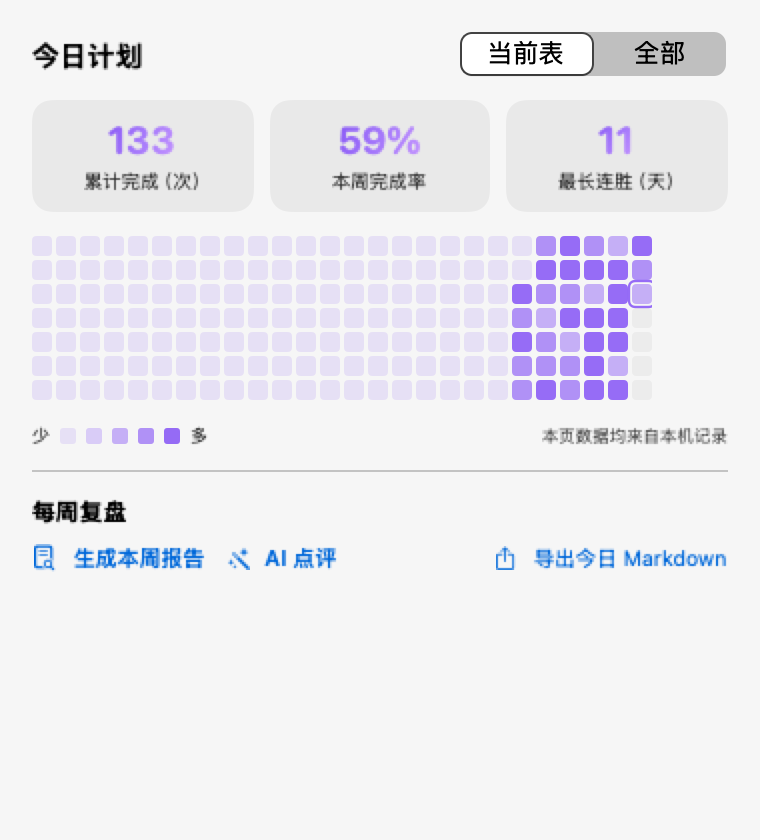
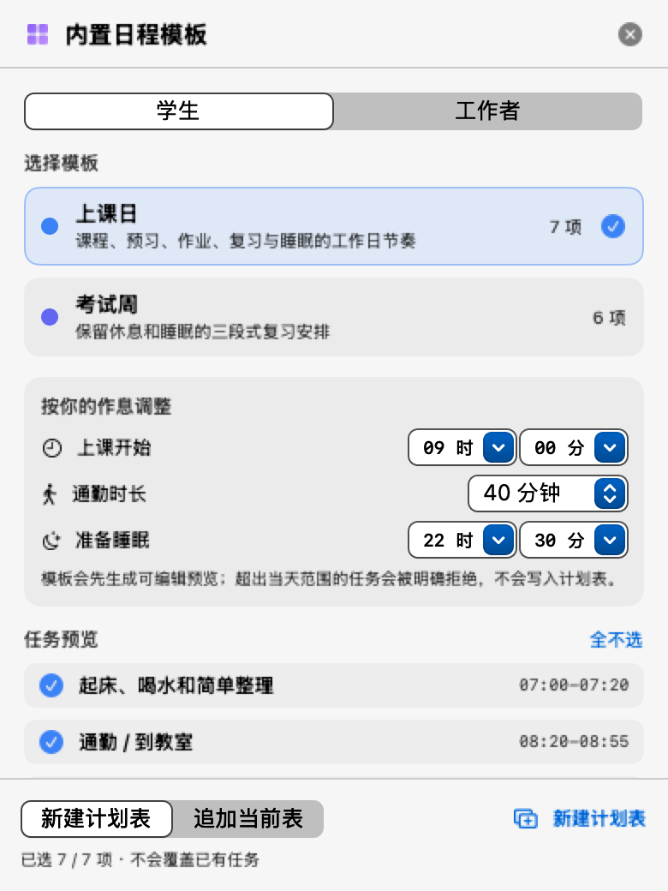
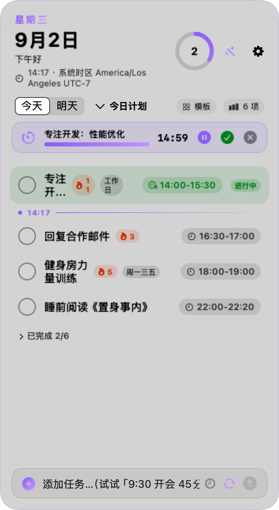

# DeskDaily

原生 macOS 桌面日程清单：把今天的任务、提醒、专注和复盘放在一张可交互的小卡片里。

<p align="center">
  
</p>

<p align="center">
  <a href="https://github.com/CDUESTC-OpenAtom-Open-Source-Club/DeskDaily/releases/latest">下载最新版本</a> ·
  <a href="docs/SHOWCASE.md">图文展示</a> ·
  <a href="docs/TEMPLATES.md">学生与工作者模板</a> ·
  <a href="docs/ROADMAP.md">迭代计划</a>
</p>


> 当前仓库已提交品牌横幅与应用图标作为视觉资产；真实运行截图会在干净演示环境制作后放入 [`docs/assets/screenshots/`](docs/assets/screenshots/)，不使用伪造截图。

## 界面预览

<!-- 真实截图就位后取消注释（文件名见 docs/SCREENSHOTS.md，需使用虚构演示数据）：
<p align="center">
  
  &nbsp;
  
  &nbsp;
  
</p>
<p align="center">
  
  &nbsp;
  
</p>
-->

## 快速了解

- **看产品**：从 [图文展示](docs/SHOWCASE.md) 按“添加 → 提醒 → AI → 统计”的工作流参观。
- **直接安装**：从 [最新 Release](https://github.com/CDUESTC-OpenAtom-Open-Source-Club/DeskDaily/releases/latest) 下载 arm64 `.dmg` 或 `.zip`。
- **看日程示例**：查看 [学生与工作者模板目录](docs/TEMPLATES.md)。
- **看开发方向**：阅读 [后续路线图](docs/ROADMAP.md)，了解可靠性、交互和模板扩展计划。

## ✨ 特性

### 核心功能
- **多计划表**：创建多个计划表（工作日、周末、项目），每张表可自定义主题色，切换时卡片整体换色
- **智能重复规则**：支持 仅今天 / 每天 / 每周指定几（工作日、周末或自选组合）
- **时段提醒**：设置任务时间 + 时长，开始和结束时各提醒一次；进行中的任务绿色高亮
- **时区灵活**：跟随系统时区或固定北京时间，跨 0 点自动刷新

### AI 智能助手 🤖
- **自然语言添加**：输入框直接打 `明早9点开会 45分钟` 或 `周二健身`，智能解析
- **AI 规划师**：对话生成今日清单（支持任意 OpenAI 兼容接口：智谱/DeepSeek/Ollama）
- **AI 长期记忆**：自动从对话中积累你的习惯偏好，越用越懂你；AI 对话和设置使用常驻辅助窗口，切换应用或桌面时不丢草稿、历史和候选计划
- **AI 睡前复盘**：每晚定时发通知，AI 拿着当日数据做点评
- **图文展示**：查看 [访客图文导览](docs/SHOWCASE.md)、[学生与工作者模板](docs/TEMPLATES.md) 和 [后续路线图](docs/ROADMAP.md)

### 数据与习惯 📊
- **连续打卡**：任务显示 🔥N 天打卡角标，最长连胜一目了然
- **年度热力图**：GitHub 风格 26 周热力图，完成率可视化
- **每周复盘报告**：本地汇总本周数据 + AI 点评，可复制分享
- **全部完成庆祝**：今日任务全打勾时，进度环喷出主题色粒子 🎉

### 效率与体验 ⚡
- **迷你折叠胶囊**：双击卡片头部折叠成小胶囊（进度 + 下一件事），屏幕占用降 90%
- **全局热键 ⌥⇧D**：任何应用里一键显示 / 隐藏卡片
- **菜单栏迷你入口**：系统菜单栏小图标，快速查看 / 勾选任务
- **明天视图**：顶部「今天 | 明天」切换，提前规划明日安排
- **番茄钟专注**：右键任务「开始专注」，顶部专注条实时倒计时
- **日程模板库**：保留个人模板；还可在「浏览内置模板…」中选择学生上课日/考试周、工作者标准工作日/轮班模板，调整作息变量、勾选任务后新建或追加

### 细节打磨 ✨
- **通知横幅操作按钮**：提醒通知自带「✓完成 / 推迟10分钟」，不用切回卡片
- **撤销删除**：⌘Z 或底部 toast「撤销」恢复误删任务
- **备份 / 恢复**：一键导出 / 导入 JSON 备份，每天自动滚动备份（保留 7 份）；导入前校验数据版本、规则、时间和 UUID，失败不覆盖现有数据
- **可靠通知与隐私**：未来 7 天内的所有计划表任务使用系统日历通知调度；API Key 存在 macOS Keychain，导出备份不包含 Key
- **边缘磁吸**：拖到屏幕边缘自动吸附贴边
- **闲置淡化**：可调时长（30–600 秒）无操作自动半透明，鼠标一碰恢复
- **Dock 徽标**：图标角标实时显示今日未完成数
- **时段冲突检测**：新增 / 修改时间时自动提示与其他任务重叠
- **星标置顶**：重要任务加星，自动排序到最前

## 📥 安装

**系统要求**：macOS 13+（Apple Silicon）

### 从 GitHub Release 安装（推荐）

1. 前往 [Releases](https://github.com/CDUESTC-OpenAtom-Open-Source-Club/DeskDaily/releases/latest) 下载最新版本
2. 下载 `DeskDaily-macOS-arm64.dmg` 或 `DeskDaily-macOS-arm64.zip`
3. **DMG 方式**：双击 DMG → 拖动 DeskDaily.app 到 Applications 文件夹
4. **ZIP 方式**：解压 → 移动 DeskDaily.app 到 `~/Applications/` 或 `/Applications/`
5. 首次打开：右键 → 打开（绕过 Gatekeeper），或在「系统设置 → 隐私与安全性」中允许

### 从源码构建

```bash
git clone https://github.com/CDUESTC-OpenAtom-Open-Source-Club/DeskDaily.git
cd DeskDaily
./build.sh
# 构建产物位于 build/DeskDaily.app
cp -R build/DeskDaily.app ~/Applications/
open ~/Applications/DeskDaily.app
```

## 🚀 使用

### 快速上手

1. **首次启动**：点「允许」授予通知权限（提醒功能必需）
2. **添加任务**：
   - 常规方式：输入标题 → 点 ⏰ 设时间 → 点 🔄 选重复规则 → 回车
   - 自然语言：直接打 `明早9点开会 45分钟`，自动解析时间与时长
3. **勾选打卡**：点圆圈完成任务；连续打卡显示 🔥N 天角标
4. **查看统计**：点顶部计划表栏右侧「N 项」→ 热力图 / 周报 / 导出
5. **AI 规划**：点右上角 ✨ → 告诉 AI 今天安排 → 生成清单一键替换

### 快捷键

| 快捷键 | 功能 |
|--------|------|
| **⌥⇧D** | 全局显示 / 隐藏卡片 |
| **⌘N** | 聚焦添加输入框 |
| **⌘Z** | 撤销删除 |
| **Esc** | 关闭弹窗 |
| **双击卡片头部** | 折叠 / 展开迷你胶囊 |

### 高级功能

**配置 AI（⚙️ 设置 → AI 标签页）**
- **智谱 GLM**：点预设芯片自动填接口地址，只需补 API Key
- **本地 Ollama**：先启动 Ollama.app 并拉取模型（如 `ollama pull qwen3:4b`），点预设芯片填好地址
- API Key 存在 macOS Keychain；云端服务会收到对话内容、当前任务和启用的记忆，导出 JSON 备份不包含 Key
- 本地 Ollama 无需 Key（`ollama serve` 后填地址即可），请求可以只留在本机
- 发布截图、Issue 和备份前请确认没有真实密钥、私人日程或聊天记录
- 说明：macOS 不对第三方开放对话式 Siri，因此采用外接 API 方案；升级到支持 Foundation Models 的系统后再评估接入苹果本机模型
- 计划表菜单 → 💾 存为模板：当前表所有任务存为模板
- 📁 从模板新建：深拷贝模板创建新计划表，快速套用常用日程

**多计划表**
- 顶部胶囊按钮切换当前执行的表，其他表为备选
- 任务 / 勾选 / 提醒各自独立，AI 规划和统计作用于当前表

## 🛠 开发

### 技术栈

- **语言**：Swift 5
- **UI**：SwiftUI（原生 macOS 组件）
- **构建**：纯 `swiftc` 命令行编译（无 Xcode 工程）
- **数据**：本地 JSON 存储（`~/Library/Application Support/DeskDaily/`）
- **架构**：单文件 ContentView（~2700 行）+ 模块分离（Store / AI / 统计 / 状态栏）
- **当前构建**：macOS 13+、Apple Silicon（arm64）；Intel Mac 暂无 universal 构建

### 项目结构

```
DeskDaily/
├── Sources/
│   ├── main.swift              # 入口 + AppDelegate + 通知代理
│   ├── ContentView.swift       # 主界面（卡片 / 设置 / AI 对话）
│   ├── Store.swift             # 数据模型 + 持久化 + 提醒逻辑
│   ├── WindowController.swift  # NSPanel 窗口控制器
│   ├── AIAssistant.swift       # OpenAI 兼容接口 + 任务解析
│   ├── StatisticsView.swift    # 统计页（热力图 / 周报）
│   ├── QuickAdd.swift          # 自然语言解析
│   ├── HotkeyManager.swift     # 全局热键 ⌥⇧D
│   └── StatusBar.swift         # 菜单栏入口
├── Resources/
│   └── Info.plist              # Bundle 配置
├── build.sh                    # 构建脚本（swiftc 一键编译）
├── .github/workflows/build.yml # GitHub Actions CI
└── README.md
```

### 本地开发

```bash
# 1. 克隆仓库
git clone https://github.com/CDUESTC-OpenAtom-Open-Source-Club/DeskDaily.git
cd DeskDaily

# 2. 编译（产物 build/DeskDaily.app）
./build.sh

# 3. 运行（开发调试）
open build/DeskDaily.app

# 4. 测试钩子（时间平移 / 隔离数据目录）
DD_TIME_SHIFT_MINUTES=60 DD_DATA_DIR=/tmp/test-data build/DeskDaily.app/Contents/MacOS/DeskDaily
```

### 贡献指南

欢迎提交 Issue 和 Pull Request！

- **Bug 报告**：请附上系统版本、复现步骤、日志（`~/Library/Application Support/DeskDaily/`）
- **功能建议**：说明使用场景和预期行为
- **代码贡献**：
  1. Fork 仓库并创建功能分支
  2. 保持代码风格一致（SwiftUI 声明式 + 注释说明意图）
  3. 确保 `./build.sh` 零 error 编译通过
  4. 数据兼容：新字段必须 `decodeIfPresent ?? 默认值`
  5. 提交 PR 并描述改动与测试方法

## 📄 许可

MIT License © 2026 CDUESTC-OpenAtom-Open-Source-Club

## 🙏 鸣谢

- 设计灵感：Fantastical、Things、Linear
- AI 能力：OpenAI 兼容生态（智谱 GLM / DeepSeek / Ollama）
- 社区贡献者：[Contributors](https://github.com/CDUESTC-OpenAtom-Open-Source-Club/DeskDaily/graphs/contributors)

---

**开发者社团**：[成都电子科技大学 - 开放原子开源俱乐部](https://github.com/CDUESTC-OpenAtom-Open-Source-Club)

