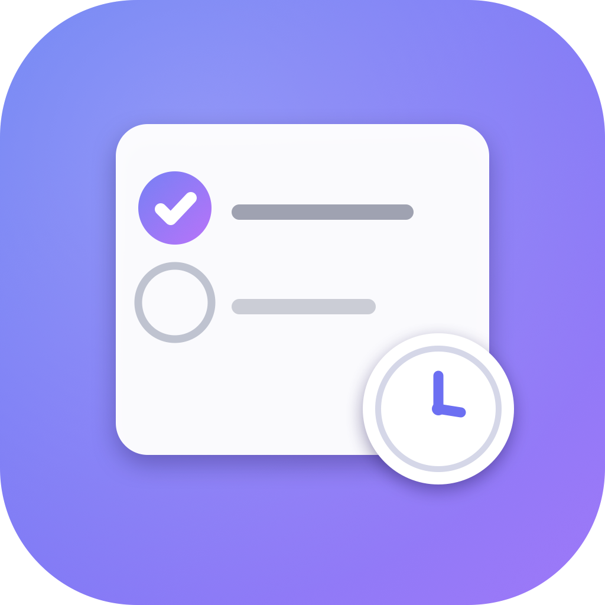

# DeskDaily 图文展示

> 给参观者看的产品导览。这里用真实的产品工作流说明 DeskDaily 如何从“想到一件事”变成“完成一件事”。

<p align="center">
  
</p>

## DeskDaily 是什么

DeskDaily 是一个原生 macOS 桌面日程清单。它把今天最重要的任务放在一个可移动的小卡片里：你可以快速添加、设定时间和时长、按工作日重复、使用多个计划表，并在完成后留下可回顾的记录。

它适合三类场景：

- **学生**：课程、预习、作业、复习、运动与睡眠
- **工作者**：通勤、会议、深度工作、午休、收尾与锻炼
- **个人生活**：家务、阅读、健康习惯和阶段性目标

应用默认按系统时区工作，也可以固定使用北京时间。AI 是可选能力，支持云端 OpenAI 兼容接口或本地 Ollama。

## 从主卡片开始

<!-- 真实运行截图待补：docs/assets/screenshots/overview-main.png -->


主卡片的阅读顺序是固定的：

1. 顶部看星期、日期、当前时间和时区。
2. 进度环看今天完成了几项，或切换为完成百分比。
3. 计划表胶囊表示当前正在执行哪一套清单。
4. 任务行显示完成状态、时间、时段、重复规则和重要星标。
5. 底部输入框负责快速创建任务，`⏰` 设时间和时长，`🔄` 设重复规则。

## 一天的任务如何形成

### 1. 快速输入

直接输入自然语言即可：

```text
明早 9 点产品评审 45 分钟
周二健身
晚上 10 点阅读 20 分钟
```

输入框上方会显示解析预览。确认无误后回车，时间、时长和重复规则一起写入当前计划表。

### 2. 设置时段

“22:00 + 20 分钟”表示一个完整时段：

- 22:00 开始提醒
- 22:00–22:20 期间任务行亮绿色并显示“进行中”
- 22:20 结束提醒

这比手工维护两个独立时间点更适合阅读、运动、学习块和专注工作。

### 3. 选择重复方式

支持仅今天、每天、工作日、周末和自选星期组合。一个任务可以设置为“周一至周五”，周六和周日不会出现在当天清单里。

## 多计划表与主题色

计划表可以按生活角色拆开：

- 紫色「今日计划」：通用生活安排
- 蓝色「课程学习」：上课、预习、作业和复习
- 绿色「工作日」：通勤、会议和深度工作
- 橙色「周末生活」：家务、运动和社交

切换计划表后，任务、完成状态、提醒和主题色都跟着切换。AI 规划和统计默认作用于当前选中的计划表。

## AI 日程规划

点击右上角的 AI 入口，先描述今天想完成什么。AI 会询问目标和空闲时段，然后输出一份完整的任务清单。

```text
我今天下午有三小时，希望完成课程作业、跑步和阅读。
```

确认卡片上的任务后，可以：

- **替换今日清单**：用 AI 优化后的完整清单覆盖当前计划表
- **追加**：保留当前任务，把新任务加到后面
- **忽略**：继续对话调整

AI 会读取当前计划表的任务状态和启用的长期记忆，因此可以根据你的习惯优化安排。每次导入前仍由你确认，避免模型输出直接改变清单。

### AI 服务与隐私边界

AI 配置支持智谱 GLM、DeepSeek 和 Ollama 等 OpenAI 兼容服务：

- 使用云端服务时，对话内容、当前任务和启用的记忆会发送到你填写的服务商。
- 使用本地 Ollama 时，请求可以只留在本机，不需要 API Key。
- API Key 和任务数据保存在本机；发布截图、Issue 和备份前请确认没有真实密钥或私人信息。

## 提醒、专注与统计

- 通知横幅可以直接“完成”或“推迟 10 分钟”。
- 右键任务可以开始番茄钟专注，顶部显示剩余时间。
- 进度环全部完成时会出现主题色庆祝动画。
- 统计页提供累计完成、本周完成率、最长连胜和最近 26 周热力图。
- 每周报告可以复制为 Markdown，也可以让 AI 做简短点评。

## 迷你胶囊与桌面共存

双击卡片顶部可以折叠成迷你胶囊，只留下进度、下一件事和专注倒计时。拖动靠近屏幕边缘会自动吸附；长时间不操作时，完整卡片可以自动淡化，鼠标经过后恢复。

全局热键 `⌥⇧D` 可以显示或隐藏卡片。菜单栏入口和 Dock 未完成数徽标可以在设置中按需开启。

## 学生与工作者的日常安排

项目内置模板和推荐安排正在持续扩展。当前推荐的模板内容见 [学生与工作者模板目录](TEMPLATES.md)，包括可直接转成计划表的任务、时间段、重复规则和适用说明。

模板的设计原则是：

- 先给出可编辑的草稿，不直接覆盖用户清单。
- 每项任务都有合理的默认时长，但允许按个人作息调整。
- 把学习、工作、健康和休息同时纳入一天，不把计划变成单纯的待办堆积。
- 给 AI 提供结构化约束，而不是让 AI 自由生成无法执行的长清单。

## 截图索引

界面截图由应用自身在演示数据模式下自动渲染（`DD_EXPORT_SHOTS=1`，均为真实界面代码产出），存放在 `docs/assets/screenshots/`，每张图对应的功能如下：

| 文件 | 展示内容 | 状态 |
|---|---|---|
| `overview-main.png` | 主卡片、今日任务、进度环与现在线 | 已生成 |
| `task-creation.png` | 自然语言添加、时间和时长 | 可选补充 |
| `ai-planner.png` | AI 对话与自然语言日程建议 | 已生成 |
| `settings-ai.png` | AI 服务预设与测试连接 | 可选补充 |
| `statistics-heatmap.png` | 热力图、统计卡片和周报 | 已生成 |
| `focus-mode.png` | 番茄钟专注条 | 已生成 |
| `template-catalog.png` | 内置模板目录与作息变量 | 已生成 |
| `menubar-quick-actions.png` | 菜单栏任务入口 | 可选补充 |

截图制作和审查规则见 [截图与发布规范](SCREENSHOTS.md)。

## 下载与参与

- [下载最新 macOS arm64 Release](https://github.com/CDUESTC-OpenAtom-Open-Source-Club/DeskDaily/releases/latest)
- [查看完整 README](../README.md)
- [提交 Issue](https://github.com/CDUESTC-OpenAtom-Open-Source-Club/DeskDaily/issues)
- [查看源代码](https://github.com/CDUESTC-OpenAtom-Open-Source-Club/DeskDaily)

DeskDaily 当前面向 macOS 13+ Apple Silicon，项目仍在持续打磨。欢迎用虚构数据体验后反馈交互、动效和日常安排是否自然。
